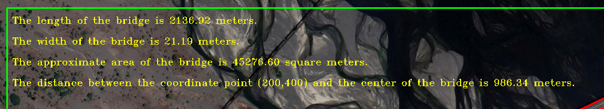

# Bridges32 - A Method for Segmentation & Measuring of Bridges in Satellite Images using OpenCV

# Abstract

Bridge detection in satellite images has strategic significance and practical value in areas such as large-scale infrastructure works, urban planning, transportation networks, and military reconnaissance. However, the arbitrary orientation, extreme aspect ratio proportions and variable backgrounds pose great challenges for their detection.

In this repository, a method for segmentation and measurement of bridges in satellite images without the need of deep learning models implementation is proposed. For this, we attempt to develop functions and algorithms that receives RGB images of multiple resolutions and allow filtering processes that selectively highlight or suppress the information contained in it to perform certain measuring tasks. 

# Introduction

With the increasing development of neural architecture technologies and their strong object detection and image segmentation capabilities, many methods for object detection in satellite images using Deep Learning have been proposed, such as corner and key point prediction models or horizontal line detection models. Some of these methods are specifically focused on detecting bridges over bodies of water and employ advanced neural architectures such as U-net, YOLOv3, Faster-RCNN, and Mask-RCNN.

However, current models have significant inconsistencies. Models for detecting bridges over rivers cannot be applied to images of bridges in urban areas without bodies of water, nor can they be applied to images with dry rivers or rivers of varying tones. Meanwhile, models using "Bounding Boxes" have many residual detections.

The goal of this study is to develop a model using algorithms and functions that combine current techniques such as segmentation, object detection, and bounding boxes to provide a method for detecting bridges under all of the above-mentioned conditions, for images of any resolution, without the need of convolutional neural networks models. This proyect will use a combination of digital image processing techniques, including filtering technologies, functions, and machine learning algorithms in open source Python programming language through OpenCV implementation. Additionally, the model should be able to measure these structures, determining specific characteristics such as length, width, approximate area, and the distance from an arbitrary point to it.

# Dataset Metadata

| Images  | Metadata |
| ------------- | ------------- |
|   | * Llacolén bridge   * asdasd|
|   | lalala  |
|   | lalala  |

# Proposed Method

1.- Edge detection

2.- Segmentation of the bridge

3.- Extraction of the contour of the bridge

4.- Extraction of geometric properties from the contour

5.- Calculation of measurements

## 1.- Edge Detection

For this process, the popular Canny edge detection algorithm was implemented, it consists of four processing stages: Noise Reduction, Intensity Gradient, Non-Maximum Suppression Criterion, and Hysteresis Thresholding.

## 2.- Segmentation

With the edges of the bridge already detected, it is necessary to perform some image refinement to get rid of the junk information. To make the task easier, the first step is to transform the input image into an image of square dimensions.

Then, basic numpy matrix operations were applied, the np.tril() and np.triu() functions. To apply these functions, the image was rotated so that the bridge was oriented with respect to the main diagonal of the matrix in a parallel or perpendicular manner. In addition, the np.flip() function has been implemented to invert the image when necessary.

The segmented bridge is obtained

## 3.- Contour Extraction

Contour detection functions were applied to the previous image and drawn over the original image so that the bridge is contoured by the edges extracted from the Canny detector implementation.

## 4.- Extraction of Geometric Properties from the Contour

From the segmented image, certain OpenCV functions that bound the bridge horizontally can also be applied, so that a Horizontal Bounding Box (HBB) is created which contains characteristic geometric properties of the bridge.

In particular, the coordinates of the ends of the bounding box were used to perform some calculations and determine the length of the bridge.

A similar process was then applied to outline the bridge in an oriented manner (OBB).

## 5.- Calculation of Measurements

The coordinates of the ends of the horizontal and vertical bounding boxes provide the necessary information to determine the length and width of the bridge, and therefore its area.

The coordinates of an arbitrary point can be input by the user in the code as an additional parameter. To find the distance between this arbitrary point and the center of the bridge, functions that calculate the centroid of the segmented bridge image can be applied.

# Model Calibration

A comparison of the results obtained with real data for the bridge showed a model error of 3.11% in terms of length and 13.6% in terms of width. To address this, an additional method called the "mask method" was developed. This method involves increasing the thickness of the contour obtained using the Canny edge detector from 1 pixel to 32 pixels. The same functions and algorithms are then applied to this modified image, resulting in a bridge mask whose edges are artificial, as opposed to the original process.

# Final Results

The error in the new results is significantly smaller, at 0.97% error for the length of the bridge and 4.54% error for the width.

The image shows the horizontal bounding box (HBB) in green, the edges detected by Canny in red, the arbitrary point and its path to the center of the bridge in blue, and the measurements made in yellow.

# Model Applied to Other Images

As expected, the current model cannot be directly applied to other images.

To apply the model to another image in the dataset, it is necessary to modify some key parameters, such as the angle of rotation, the pixels/meter ratio, and the tril & triu parameters.

# Conclusions

* The model can be applied to images of any resolution, containing bridges of any size and orientation, regardless of background noise such as that found in images of dry rivers or islands.

* The model can also be used to perform measurements on non-bridge objects, such as cars, houses, boats or any infrastructure.

* Mask generation method increases measurement accuracy.

* The code can be applied to different images but requires the user to manually enter the parameters when changing the input image and determining these parameters can be a significant time consuming task.

# Future Work & Community Contributions

The current model provides a foundation for a variety of potential paths. It can be considered a starting point for preprocessing detection models based on convolutional networks or it can be reformulated as an automated machine learning algorithm.

## Code Optimization

The current code is rudimentary, it could be optimized by implementing functions or objects in such a way that they perform the same task using fewer lines of code.

## Model Automation

This is a complicated task. To automate the model it is necessary to eliminate the need for the user to manually enter the parameters when switching between images.

The parameters that present the most difficulty for this task are the hysteresis parameters of the Canny edge detector, the angle of rotation of the image and the diagonal parameters for tril & triu operations.

* Hysteresis parameters

  Tt may be possible to develop a model that determines the optimal parameters to use in the Canny edge detector. One way to do this would be to train a machine learning model with a set of input images and the expected outputs (the edges detected by Canny with different parameters). Then, the trained model could be used to predict which set of parameters should be used to achieve the best results on new images.

* Angle of Rotation

  This seems to be more manageable. One way to perform image alignment is to use feature-based methods, which identify distinctive features in the images and use them to determine the transformation needed to align the images. Another approach is to use intensity-based methods, which minimize the difference in intensity between the images being aligned.

  Once the transformation needed to align the images has been determined, the angle of rotation can be calculated from the transformation matrix. It is also possible to use machine learning techniques, such as a convolutional neural network, to learn the transformation needed to align the images from a training set of aligned images.

* Tril & Triu Parameters

  To eliminate the need to manually determine these parameters, It may be useful to use some of these morphological operations to improve the processing. For example, erosion can be used to remove noise or dilation can be used to connect parts of an object that have been separated by an edge detector.
