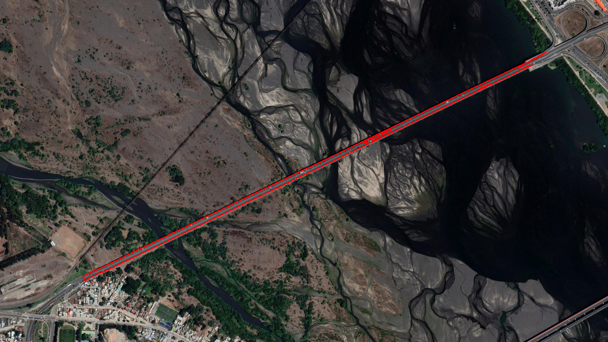

# Bridges32 - A Method for Segmentation & Measuring of Bridges in Satellite Images using OpenCV

# Abstract

Bridge detection in satellite images has strategic significance and practical value in areas such as large-scale infrastructure works, urban planning, transportation networks, and military reconnaissance. However, the arbitrary orientation, extreme aspect ratio proportions and variable backgrounds pose great challenges for their detection.

In this repository, a method for segmentation and measurement of bridges in satellite images is proposed. For this, we attempt to develop functions and algorithms that receives RGB images of multiple resolutions and allow filtering processes that selectively highlight or suppress the information contained in it to perform certain measuring tasks. 

# Introduction

# Proposed Method

1.- Edge detection

2.- Segmentation of the bridge

3.- Extraction of the contour of the bridge

4.- Extraction of geometric properties from the contour

5.- Calculation of measurements

## 1.- Edge Detection

Blablabla

## 2.- Segmentation

Blablabla

After this...blablabla

Finally we get...blabla

## 3.- Contour Extraction

asdasd

## 4.- Extraction of Geometric Properties from the Contour

asdasd

## 5.- Calculation of Measurements

asdasd

# Model Calibration

Blablabla...

# Final Results

Blablabla

# Model Applied to Other Images

Of course...blblabla

# Conclusions

* The model can be applied to images of any resolution, containing bridges of any size and orientation, regardless of background noise such as that found in images of dry rivers or islands.

* The model can also be used to perform measurements on non-bridge objects, such as cars, houses, boats or any infrastructure.

* Mask generation method increases measurement accuracy.

* The code can be applied to different images but requires the user to manually enter the parameters when changing the input image and determining these parameters can be a significant time consuming task.

# Future Work & Community Contributions

The current model opens the way to a series of diverse possible paths. It can be considered a starting point for the preprocessing of detection models based on convolution networks or it can be reformulated in such a way that it has an automated performance like a machine learning algorithm.

## Code Optimization

The current code is rudimentary, it could be optimized by implementing functions or objects in such a way that they perform the same task using fewer lines of code.

## Model Automation

This is a complicated task. To automate the model it is necessary to eliminate the need for the user to manually enter the parameters when switching between images.

The parameters that present the most difficulty for this task are the hysteresis parameters of the Canny edge detector, the angle of rotation of the image and the diagonal parameters for tril & triu operations.

* Hysteresis parameters

  asdasdasd
  asdasd
  asd
